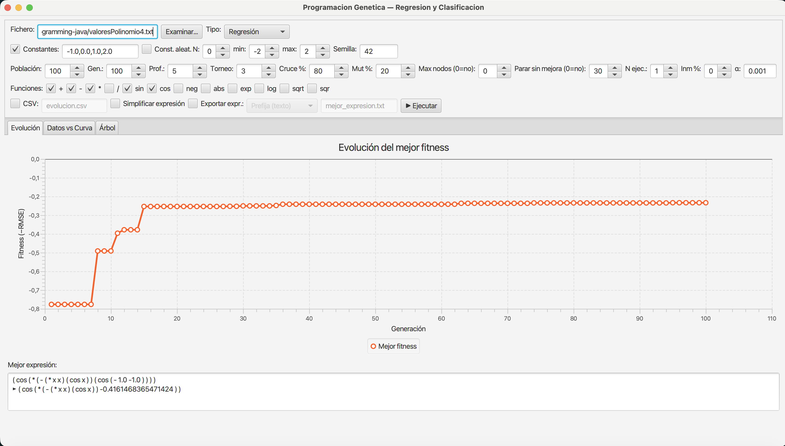
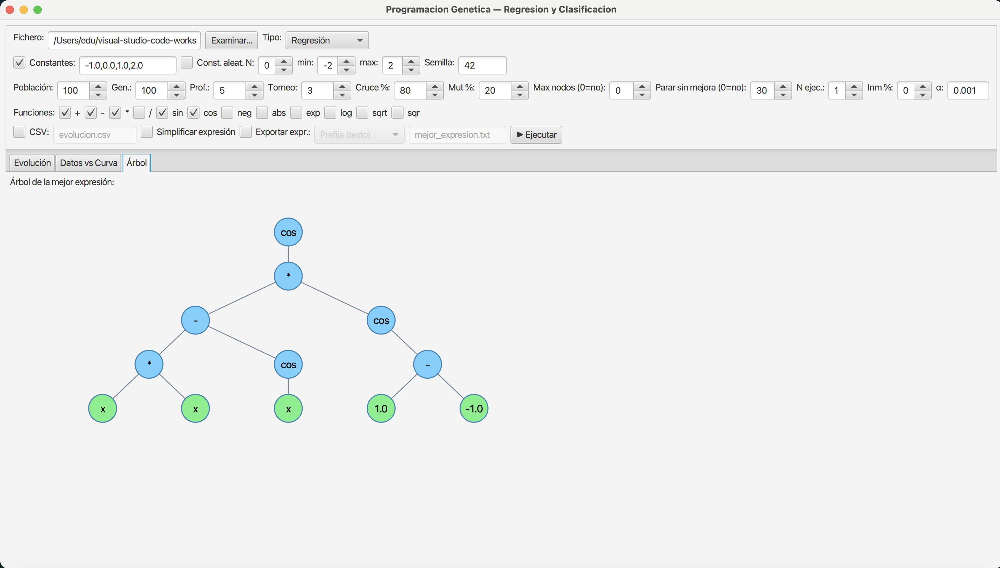
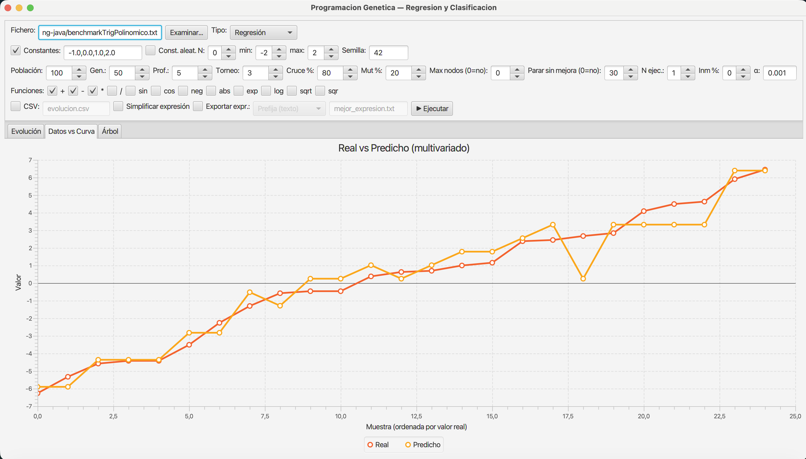

# Genetic Programming in Java

Implementación completa de **Programación Genética (GP)** en Java puro: evolución de árboles de expresiones para regresión simbólica, clasificación binaria y síntesis de funciones booleanas. Incluye interfaz gráfica en JavaFX para configuración interactiva y visualización de resultados.

> Proyecto educativo/experimental. No es una librería de producción.

---

## Screenshots

| Evolución del fitness | Árbol de la mejor expresión | Real vs Predicho (multivariado) |
|---|---|---|
|  |  |  |

---

## Qué hace

- **Regresión simbólica** — dado un dataset (x, y), el algoritmo busca una expresión matemática que minimice el error cuadrático medio (RMSE). No impone a priori la forma de la función.
- **Regresión multivariada** — ficheros con 3+ columnas se auto-detectan; las variables reciben nombres automáticos (`v0`, `v1`, …) o desde cabecera.
- **Clasificación binaria** — expresiones que maximizan la precisión sobre datos etiquetados 0/1.
- **Síntesis booleana** — expresiones AND/OR/NOT/XOR que reproducen tablas de verdad.

El dominio de regresión aplica **escalado lineal** (ajuste a·f(x)+b por mínimos cuadrados) antes de calcular el fitness, lo que mejora significativamente la convergencia cuando la expresión encontrada es proporcional a la solución correcta pero no está a la misma escala.

---

## Technical highlights

### Algoritmo
- **Representación:** árboles de expresiones en notación prefija. Nodos internos: funciones (`+`, `−`, `*`, `/`, `sin`, `cos`, `neg`, `abs`, `exp`, `log`, `sqrt`, `sqr`). Hojas: variables y constantes (fijas o efímeras aleatorias).
- **Inicialización:** *ramped half-and-half* (mitad `full`, mitad `grow`) para maximizar la diversidad inicial — método estándar de Koza (1992).
- **Selección:** torneo configurable o ranking por rango².
- **Cruce:** intercambio de subárboles, compatible con funciones de cualquier aridad (binarias y unarias). Reintentos ante cruce nulo con fallback a copia de progenitores.
- **Mutación** en tres modalidades con probabilidades configurables:
  - *Subárbol* — reemplaza un subárbol por uno generado aleatoriamente.
  - *Punto* — perturba una constante o sustituye una función por otra de la misma aridad.
  - *Contracción (shrink)* — reemplaza un subárbol completo por un terminal.
- **Elitismo estricto** — el mejor individuo siempre se copia de forma defensiva a la siguiente generación, desacoplado del porcentaje de cruce. El fitness nunca retrocede entre generaciones.
- **Inmigrantes aleatorios** (opcional) — al final de cada generación, un porcentaje configurable de la población se reemplaza por individuos nuevos para mitigar convergencia prematura en plateaus. El elite nunca se reemplaza.
- **Parada por estancamiento** — configurable: número de generaciones sin mejora antes de detener.

### Robustez numérica e interpretabilidad
- **División protegida** (estilo Koza): `/ x 0 → 1`. Previene NaN/Infinity en evaluación.
- Las predicciones inválidas (`NaN`, `Infinity`, `|valor| > umbral`) se detectan, se reemplazan con un valor de clamp y generan un flag `tieneSingularidades` visible en la GUI (`⚠ Singularidades detectadas`).
- **Penalización por parsimonia** (α·nodos): desfavorece expresiones complejas para evitar sobreajuste y mejorar interpretabilidad.
- **Simplificación algebraica** post-evaluación: `x+0→x`, `x*1→x`, plegado de constantes, etc. Las singularidades estructurales (`/ 1.0 0.0`) no se pliegan para que sean visibles.
- **Exportación** de la mejor expresión a notación prefija, LaTeX o Python.

### GUI (JavaFX)
- Panel de configuración completo: parámetros del algoritmo, selección de funciones por checkbox, constantes fijas y efímeras aleatorias.
- Gráfico de evolución del fitness por generación (tiempo real).
- Árbol visual de la mejor expresión (BFS, canvas).
- Gráfico "Real vs Predicho" para datasets multivariados.
- Múltiples ejecuciones con estadísticas: media, std, min/max fitness y tasa de éxito.

---

## Cómo ejecutarlo

**Requisitos:** JDK 11+, Maven 3.6+

```bash
# Compilar
mvn compile

# Tests
mvn test

# Interfaz gráfica
mvn javafx:run
```

Para ejecutar sin GUI (runners de consola):

```bash
java -cp target/classes test.TesterAlgoritmoProgramacionGenetica [fichero_datos]
java -cp target/classes test.TesterDemoValores
```

El directorio de trabajo debe ser la raíz del proyecto para que los ficheros de datos se resuelvan correctamente.

---

## Datasets y benchmarks

La raíz del proyecto incluye datasets de ejemplo para todos los modos:

| Fichero | Tipo | Descripción |
|---------|------|-------------|
| `valoresX2.txt` | Regresión | y = x² — caso base, converge rápido |
| `valoresCubica.txt` | Regresión | y = x³ |
| `valoresSeno.txt` | Regresión | y = sin(x) |
| `valoresTrigComplejo.txt` | Regresión | y = sin(x) + 0.5·cos(2x) |
| `valoresExpGauss.txt` | Regresión | y = exp(−x²) |
| `valoresX2Ruido.txt` | Regresión | y ≈ x² con ruido |
| `valoresMultiVar.txt` | Multivariada | z ≈ x² + y² |
| `valoresMultivariadoTrigPolinomico.txt` | Multivariada | z = sin(x)+cos(y)+xy+x²−y², 64 puntos |
| `benchmarkPolinomioCubico.txt` | Benchmark | y = x³+x²+x en [−2, 2] |
| `benchmarkMultivariado.txt` | Benchmark | z = x+y+xy, rejilla 5×5 |
| `benchmarkTrigPolinomico.txt` | Benchmark | z = sin(x)+cos(y)+xy+x²−y², rejilla 5×5 |
| `clasificacionXOR.csv` | Clasificación | XOR (no lineal) |
| `clasificacionCirculo.csv` | Clasificación | Dentro/fuera de círculo |
| `tablaVerdad.txt` | Booleano | Mayoría de 3 bits |
| `tablaVerdad4vars.txt` | Booleano | Parity de 4 bits |

Ver [`BENCHMARK.md`](BENCHMARK.md) para parámetros recomendados y resultados medidos.

### Cómo interpretar "Real vs Predicho" (multivariado)

Para datasets con 2 o más variables de entrada no es posible trazar una curva 2D tradicional. La visualización ordena todos los puntos del dataset **por valor real ascendente** (no por posición espacial) y superpone dos curvas: el valor real y el predicho por la mejor expresión (con escalado lineal aplicado). Una alineación cercana indica buen ajuste global; las desviaciones locales reflejan los términos que la expresión no ha capturado.

---

## Limitaciones

- **La GP es estocástica.** Los resultados dependen de la semilla, los parámetros elegidos y el conjunto de funciones activadas. Distintas ejecuciones pueden dar expresiones muy diferentes para el mismo problema.
- **No siempre encuentra la fórmula exacta.** En problemas complejos (funciones trigonométricas + polinómicas + multivariadas) el algoritmo tiende a encontrar aproximaciones válidas en lugar de la expresión analítica exacta. La tasa de éxito exacto en el benchmark más difícil incluido es del 0% en 5 ejecuciones — lo que es esperado y documentado.
- **Escalabilidad limitada.** No está diseñado para datasets grandes ni para experimentos con poblaciones de decenas de miles de individuos. El rendimiento es adecuado para experimentación y aprendizaje.
- **Sin paralelismo.** El algoritmo corre en un único hilo (el Task de JavaFX lo separa de la UI, pero no paraleliza la evaluación).
- **Sin persistencia.** No hay guardado/carga de poblaciones ni de modelos entrenados.

---

## Tests

Suite JUnit 5 con 61 tests que cubren:

- Creación de individuos (full/grow), estructura del árbol, evaluación.
- Cruce (cualquier aridad, funciones unarias, progenitores no modificados).
- Mutación (subárbol, punto, contracción; original inalterado).
- Algoritmo completo: poblaciones de tamaño impar, elitismo (fitness no decrece con cruce=100%), inmigrantes no reemplazan al elite.
- Dominios: aritmético (RMSE, escalado lineal), clasificación, booleano.
- Utilidades: simplificación algebraica, exportación de expresiones.

```bash
mvn test
```

---

## Documentación

- [`doc/DOCUMENTACION.md`](doc/DOCUMENTACION.md) — Arquitectura, operadores, dominios y utilidades.
- [`BENCHMARK.md`](BENCHMARK.md) — Suite de benchmarks con parámetros y resultados medidos.
- [`changelog.md`](changelog.md) — Historial de cambios.

---

## Estructura del proyecto

```
├── pom.xml
├── README.md
├── BENCHMARK.md
├── changelog.md
├── LICENSE
├── valores*.txt, clasificacion*.csv, tablaVerdad*.txt, benchmark*.txt
├── doc/screenshots/
├── doc/
│   └── DOCUMENTACION.md
└── src/
    ├── main/java/
    │   ├── algoritmogenetico/       # Algoritmo, dominios, individuos, nodos, utilidades
    │   ├── excepciones/
    │   └── gui/                     # AppGP (JavaFX)
    └── test/java/test/              # Tests JUnit 5
```

---

## Qué es la Programación Genética

La **Programación Genética** es una técnica de búsqueda y optimización que evoluciona **estructuras de programa** en lugar de parámetros numéricos. Cada individuo es un árbol de expresión; la población evoluciona mediante selección, cruce y mutación hasta que una expresión minimiza el error sobre los datos de entrenamiento.

A diferencia de la regresión clásica (que asume una forma funcional fija), la GP **descubre la forma de la función** a partir de los datos y de un conjunto de operadores primitivos definido por el usuario.

---

## Licencia

MIT License. Copyright (c) Eduardo Díaz Sánchez. Ver [LICENSE](LICENSE).
